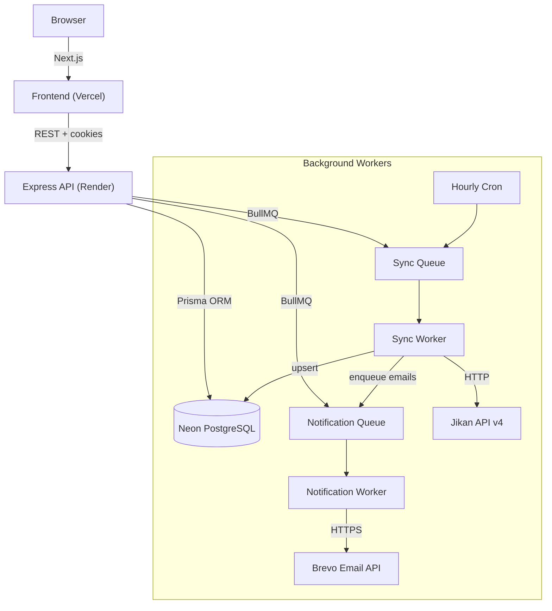

<p align="center">
  
</p>

<h1 align="center">Tsuchi</h1>

<p align="center">
  <b>Automated anime episode tracking & instant email notifications.</b>
</p>

<p align="center">
  <a href="https://tsuchi-nu.vercel.app"></a>
  <a href="https://tsuchi.onrender.com/health"></a>
</p>

---

## What is Tsuchi?

Tsuchi (通知 — Japanese for *notification*) tracks currently airing anime series and sends you an email the moment a new episode drops. Subscribe to the shows you're watching, and never miss a release again.

---

## Tech Stack

| Layer | Technology |
|---|---|
| **Frontend** | Next.js 16 · React 19 · Tailwind CSS v4 · OGL (WebGL shaders) |
| **Backend** | Express 5 · Bun runtime |
| **Database** | PostgreSQL (Neon) · Prisma ORM 7 (`@prisma/adapter-pg`) |
| **Auth** | Better Auth (email + password, session cookies) |
| **Job Queues** | BullMQ · Upstash Redis |
| **Email** | Brevo transactional API (HTTP, no SMTP) |
| **External API** | Jikan v4 (MyAnimeList) |
| **Hosting** | Vercel (frontend) · Render (backend) |

---

## How It Works



1. **Hourly sync** — A BullMQ cron job fetches the current season from the Jikan API, upserts anime data into PostgreSQL, and detects new episode increments.
2. **Queued notifications** — When a new episode is found, email jobs are bulk-enqueued for every subscriber of that anime.
3. **Async delivery** — The notification worker processes email jobs (up to 10 concurrently) through Brevo's HTTP API with automatic retries and exponential backoff.
4. **Admin audit trail** — The master admin email receives a copy of every notification and a post-sync summary report.

---

## Data Model

```
User ──< Subscription >── Anime
 │
 ├── Session
 ├── Account
 └── (Verification)
```

| Model | Purpose |
|---|---|
| `User` | Registered account (email, name) |
| `Anime` | Tracked series (externalId → MAL, latestEpisode, status, poster) |
| `Subscription` | Many-to-many link between User ↔ Anime |
| `Session` / `Account` / `Verification` | Managed by Better Auth |

---

## Pages

| Route | Description |
|---|---|
| `/` | Homepage — browse all currently airing anime, subscribe/unsubscribe |
| `/login` | Email + password authentication |
| `/dashboard` | Personal subscription radar — manage your watchlist |

The UI uses a dark glassmorphism aesthetic with a GPU-rendered WebGL shader canvas (`GhostFibers`) behind the content layer.

---

## Getting Started

### Prerequisites

- [Bun](https://bun.sh) ≥ 1.3
- [PostgreSQL](https://neon.tech) database (Neon free tier works)
- [Upstash Redis](https://upstash.com) instance (free tier works)
- [Brevo](https://brevo.com) account (free — 300 emails/day)

### 1. Clone & install

```bash
git clone https://github.com/vector15-05/Tsuchi.git
cd Tsuchi

# Backend dependencies
bun install

# Frontend dependencies
cd client && bun install && cd ..
```

### 2. Configure environment

**Backend** — copy `.env.example` → `.env` and fill in:

```env
DATABASE_URL="postgresql://..."
REDIS_URL="rediss://..."
PORT=6767
BETTER_AUTH_URL="http://localhost:6767"

BREVO_API_KEY="xkeysib-..."
BREVO_FROM_EMAIL="your-verified@gmail.com"
BREVO_FROM_NAME="Tsuchi"
ADMIN_EMAIL="your@email.com"

FRONTEND_URL="http://localhost:3000"
LOG_LEVEL=info
```

**Frontend** — copy `client/.env.example` → `client/.env.local`:

```env
API_URL="http://localhost:6767/api"
BETTER_AUTH_URL="http://localhost:6767"
```

### 3. Database setup

```bash
npx prisma generate
npx prisma migrate dev
```

### 4. Run

```bash
# Terminal 1 — Backend (API + workers)
bun run dev

# Terminal 2 — Frontend
cd client && bun run dev
```

- **Backend**: `http://localhost:6767`
- **Frontend**: `http://localhost:3000`

---

## Deployment

| Component | Platform | Notes |
|---|---|---|
| Frontend | **Vercel** | Auto-deploys from `client/` directory |
| Backend | **Render** | Web service running `bun run src/index.ts` |

Set all env vars from `.env.example` in the respective platform dashboards. Key differences for production:

- `BETTER_AUTH_URL` → your Render service URL
- `FRONTEND_URL` → your Vercel deployment URL
- Cookie `sameSite: "none"` and `secure: true` are pre-configured for cross-origin auth

---

## API Endpoints

| Method | Endpoint | Auth | Description |
|---|---|---|---|
| `GET` | `/api/anime` | No | List all currently airing anime |
| `POST` | `/api/subscribe` | Yes | Subscribe to an anime |
| `DELETE` | `/api/unsubscribe` | Yes | Unsubscribe from an anime |
| `GET` | `/api/user/subscriptions` | Yes | Get current user's subscriptions |
| `POST` | `/api/admin/trigger-sync` | No | Manually trigger an anime sync job |
| `GET` | `/health` | No | Health check |
| `ALL` | `/api/auth/*` | — | Better Auth routes (login, register, session) |

---

## Project Structure

```
Tsuchi/
├── client/                     # Next.js 16 frontend
│   ├── app/                    # App Router pages (home, login, dashboard)
│   ├── components/             # UI components (AnimeCard, Button, Toast, etc.)
│   └── src/lib/                # API client, auth client
├── src/                        # Express backend
│   ├── controllers/            # Route handlers
│   ├── lib/                    # Core modules
│   │   ├── auth.ts             # Better Auth config + welcome email hook
│   │   ├── mailer.ts           # Brevo email dispatcher
│   │   ├── prisma.ts           # Prisma client
│   │   └── redis.ts            # Redis connection factory (BullMQ)
│   ├── queues/                 # BullMQ queue definitions
│   ├── routes/                 # Express route files
│   ├── workers/                # Background job processors
│   │   ├── syncWorker.ts       # Jikan API sync + episode detection
│   │   └── notificationWorker.ts  # Email dispatch worker
│   └── index.ts                # Server entrypoint
├── prisma/
│   └── schema.prisma           # Database schema
└── package.json
```

---

## License

[MIT](LICENSE)
